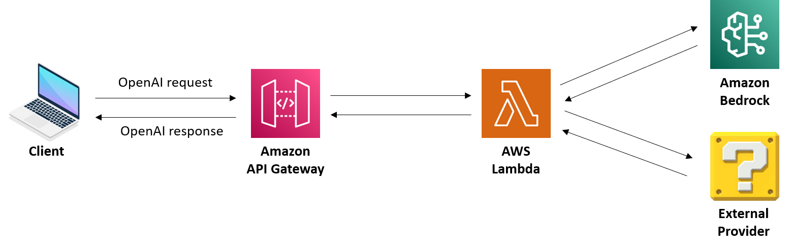
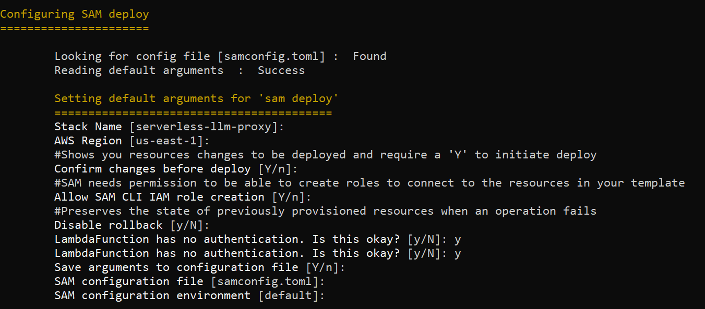
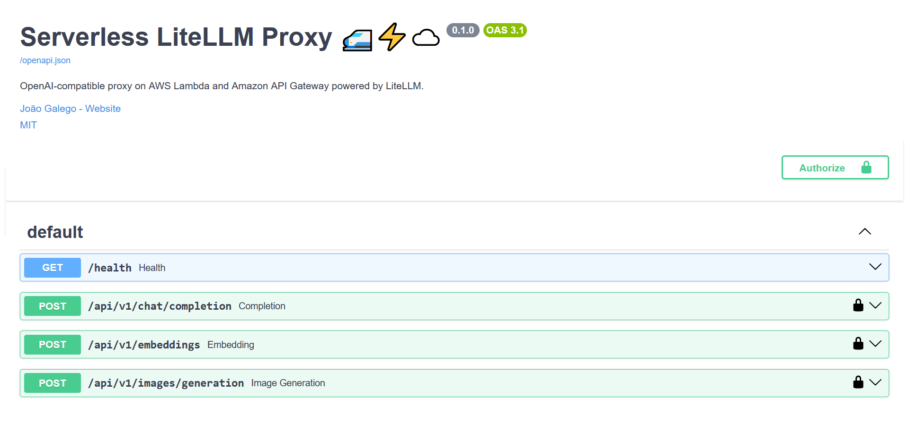
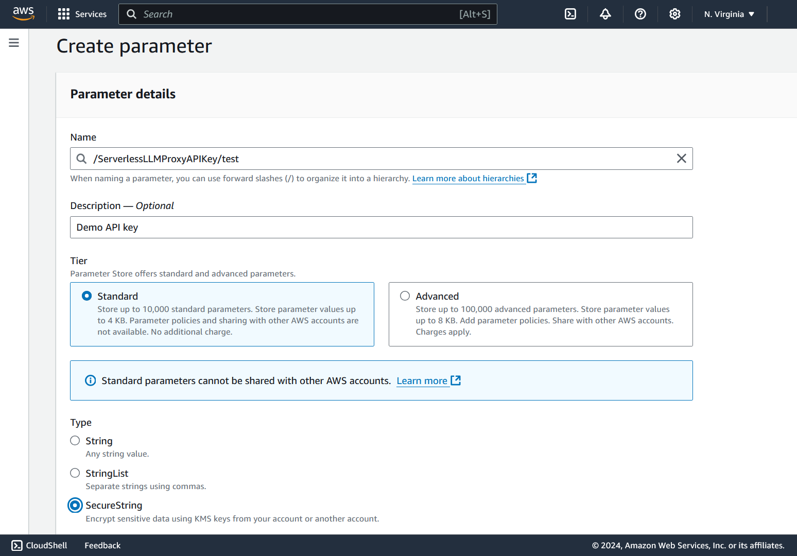
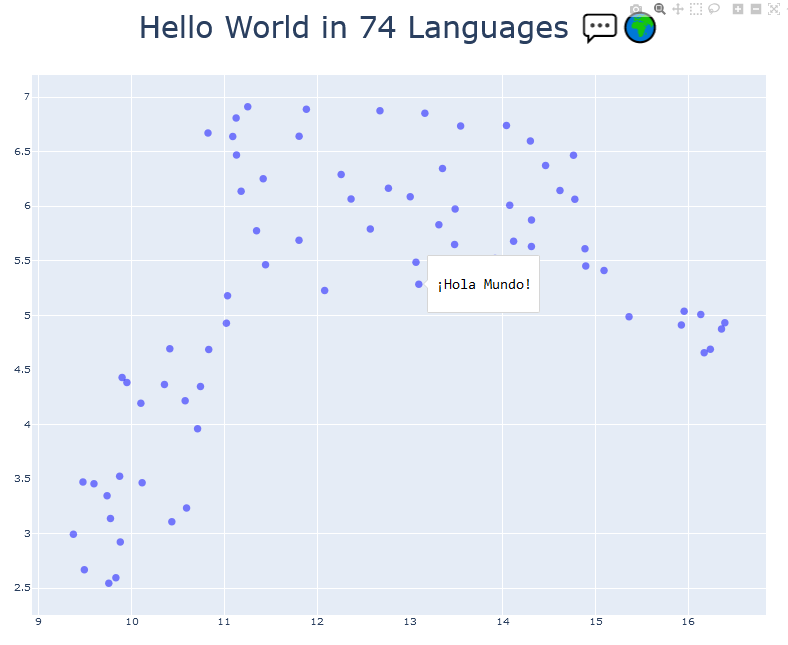

# Serverless LLM Proxy ✨

## Overview

OpenAI-compatible proxy on [AWS Lambda](https://aws.amazon.com/lambda/) powered by [LiteLLM](https://litellm.vercel.app/) and [Amazon API Gateway](https://aws.amazon.com/api-gateway/) powered by [LiteLLM](https://litellm.vercel.app/).



## Prerequisites

Make sure the following tools are installed and properly configured:

* [Docker 🐋](https://docs.docker.com/engine/install/): `docker info`

* [AWS SAM CLI 🐿️](https://docs.aws.amazon.com/serverless-application-model/latest/developerguide/install-sam-cli.html): `sam --version`

* [jq](https://jqlang.github.io/jq/download/) (*Optional*): `jq --help`

## Instructions

### Option A: Deploy with AWS SAM 🚀

0. Set up AWS credentials.

    > 💡 For more information on how to do this, please refer to the [AWS Boto3 documentation](https://boto3.amazonaws.com/v1/documentation/api/latest/guide/credentials.html) (Developer Guide > Credentials).

    ```bash
    # Option 1: (recommended) AWS CLI
    aws configure

    # Option 2: environment variables
    export AWS_DEFAULT_REGION=...
    export AWS_ACCESS_KEY_ID=...
    export AWS_SECRET_ACCESS_KEY=...
    export AWS_SESSION_TOKEN=...
    ```

1. Build and deploy the application.

    ```bash
    # 🏗️ Build
    sam build --use-container

    # 🚀 Deploy
    sam deploy --guided

    # ❗ Don't forget to note down the API URL
    sam list stack-outputs --stack-name serverless-llm-proxy
    ```

	

### Option B: Run Locally 🏠

0. Set up AWS credentials.

1. Start the proxy app

    ```bash
    python src/app.py
	```

2. Head over to [localhost:8000/docs](http://localhost:8000/docs) ◝(ᵔᗜᵔ)◜

	

### Managing API Keys 🔑

Create and handle API keys via [AWS Systems Manager Parameter Store](https://docs.aws.amazon.com/systems-manager/latest/userguide/systems-manager-parameter-store.html).

🚩 **Important Note:** By default, the application will look for `SecureString` parameters starting with `ServerlessLLMProxyAPIKey` and check the provided key against all of them as part of authentication.



## How to use

**Set up environment variables** ⚙️

```bash
export INVOKE_URL=...
export OPENAI_BASE_URL=$INVOKE_URL/api/v1
export OPENAI_API_KEY=...
```

**Perform completions** ➡️

```bash
curl -s -X POST "$OPENAI_BASE_URL/chat/completions" \
        -H "Authorization: Bearer $OPENAI_API_KEY" \
        -H "Accept: application/json" \
        -H "Content-Type: application/json" \
        -d@examples/chat_completions.json \
| jq -r .choices[0].message.content
```

> The answer, my friend, is 42. A number so profound, it bends the very fabric of existence. Ponder it, and the cosmos shall reveal its secrets, one towel at a time.

**Generate embeddings** ↗️

```bash
curl -s -X POST "$OPENAI_BASE_URL/embeddings" \
        -H "Authorization: Bearer $OPENAI_API_KEY" \
        -H "Accept: application/json" \
        -H "Content-Type: application/json" \
        -d@examples/embeddings.json \
| jq -r '.data[].embedding | @csv' > examples/hello_world.csv

# Plot with Matplotlib
cd examples
python plot_embeddings.py

# Explore with Dash
python explore_embeddings.py
```



**Produce images** 🖼️

```bash
curl -s -X POST "$OPENAI_BASE_URL/images/generations" \
        -H "Authorization: Bearer $OPENAI_API_KEY" \
        -H "Accept: application/json" \
        -H "Content-Type: application/json" \
        -d@examples/image_generation.json \
| jq -r .data[0].b64_json | base64 -d > assets/astronaut.jpg
```


**Check if the proxy is still up**

```bash
# 🚩 Notice that we're using the invoke URL directly!
curl -s -X GET "$INVOKE_URL/health" \
        -H "Accept: application/json" \
        -H "Content-Type: application/json" | jq -r .
```

**Do it all over again with the OpenAI client**

```python
"""
Call Serverless LiteLLM Proxy via OpenAI SDK
"""

# Standard imports
import json
import logging

# Library imports
from openai import OpenAI

# (optional) Set logging level
logging.basicConfig()
logging.getLogger('openai').setLevel(logging.DEBUG)

# Initialize client
# Note: Base URL and API are injected via env vars
client = OpenAI()

# Chat Completions
# https://platform.openai.com/docs/api-reference/images/create

with open("chat_completions.json", 'r', encoding="utf-8") as f:
    payload = json.load(f)
    response = client.chat.completions.create(**payload)
    print(response.choices[0].message.content)

# Embeddings
# https://platform.openai.com/docs/api-reference/embeddings/create

with open("embeddings.json", 'r', encoding="utf-8") as f:
    payload = json.load(f)
    response = client.embeddings.create(
        **payload,
        encoding_format=None
    )
    print(response.data[0].embedding)

# Image Generation
# https://platform.openai.com/docs/api-reference/images/create

with open("image_generation.json", 'r', encoding="utf-8") as f:
    payload = json.load(f)
    payload.pop('seed')  # not supported
    response = client.images.generate(**payload)
    print(response.data[0].b64_json)
```
